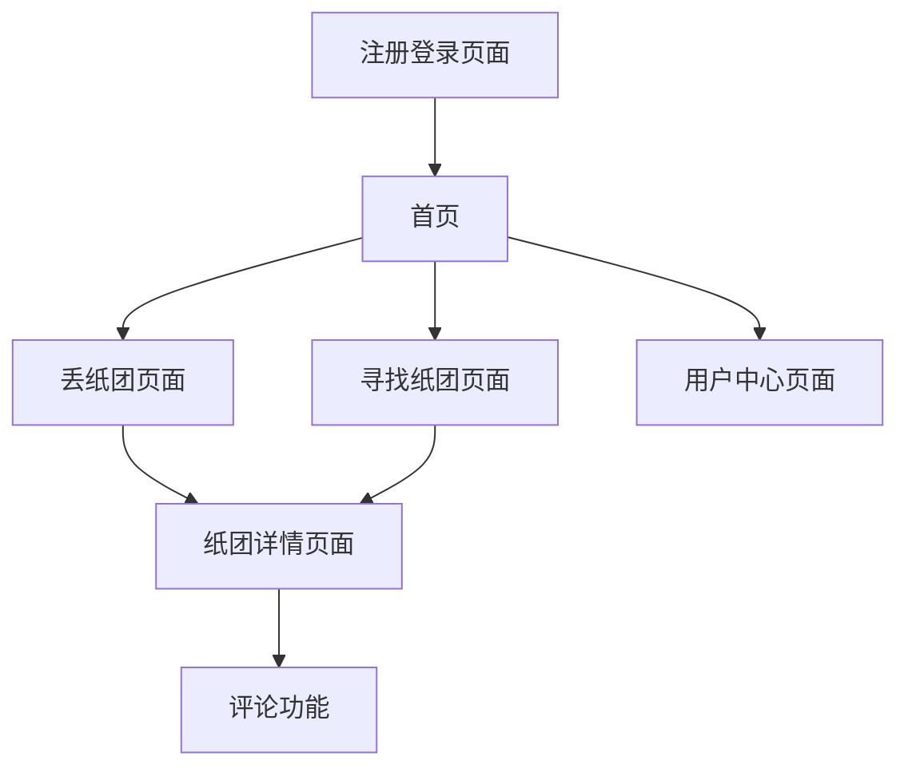

# 纸团 - 基于地理位置的社交应用产品需求文档

## 1. 产品概述

纸团是一款基于地理位置的移动端社交应用，用户可以在当前位置"丢纸团"分享内容，也可以在附近"寻找纸团"发现他人分享的内容。应用采用H5技术开发，后期可打包为微信小程序，提供匿名社交体验。

产品旨在创造一种全新的基于地理位置的内容分享方式，让用户能够发现身边有趣的内容和故事，促进本地化社交互动。

## 2. 核心功能

### 2.1 用户角色

| 角色   | 注册方式    | 核心权限              |
| ---- | ------- | ----------------- |
| 匿名用户 | 昵称+密码注册 | 可丢纸团、寻找纸团、评论、修改头像 |

### 2.2 功能模块

我们的纸团应用包含以下主要页面：

1. **首页**：功能导航、附近纸团预览、用户状态显示
2. **丢纸团页面**：内容创建、多媒体上传、位置确认、丢弃动画
3. **寻找纸团页面**：纸团搜索、距离筛选、发现动画
4. **纸团详情页面**：内容展示、评论区、用户互动
5. **用户中心页面**：个人信息、头像设置、历史记录
6. **注册登录页面**：用户注册、登录验证、昵称唯一性检查

### 2.3 页面详情

| 页面名称   | 模块名称  | 功能描述                  |
| ------ | ----- | --------------------- |
| 首页     | 导航模块  | 显示丢纸团、寻找纸团入口按钮，炫酷动画效果 |
| 首页     | 附近预览  | 展示附近纸团数量和最新内容预览       |
| 首页     | 用户状态  | 显示当前用户昵称、头像、在线状态      |
| 丢纸团页面  | 内容编辑器 | 支持文字、图片、语音、视频内容输入和编辑  |
| 丢纸团页面  | 位置服务  | 获取当前GPS坐标，显示位置信息      |
| 丢纸团页面  | 传感器交互 | 监听加速度传感器，识别丢弃手势动作     |
| 丢纸团页面  | 丢弃动画  | 播放纸团飞出动画效果，支持手势和按钮触发  |
| 寻找纸团页面 | 地图显示  | 显示当前位置和10米范围内的纸团分布    |
| 寻找纸团页面 | 搜索功能  | 在指定范围内搜索可用纸团，带搜索动画    |
| 寻找纸团页面 | 距离计算  | 计算用户与纸团的实际距离，实时更新     |
| 纸团详情页面 | 内容展示  | 完整显示纸团内容，支持多媒体播放      |
| 纸团详情页面 | 评论系统  | 用户可对纸团添加评论，支持匿名评论     |
| 纸团详情页面 | 互动功能  | 点赞、收藏、分享等社交互动功能       |
| 用户中心页面 | 个人信息  | 显示和编辑用户昵称、个人简介        |
| 用户中心页面 | 头像管理  | 上传和更换用户头像，提供默认头像选择    |
| 用户中心页面 | 历史记录  | 查看已丢弃和已发现的纸团历史        |
| 注册登录页面 | 用户注册  | 昵称唯一性验证、密码设置、默认头像分配   |
| 注册登录页面 | 登录验证  | 用户身份验证、会话管理、自动登录      |

## 3. 核心流程

**用户注册流程：**
用户输入唯一昵称和密码 → 系统验证昵称可用性 → 创建账户并分配默认头像 → 自动登录进入首页

**丢纸团流程：**
用户进入丢纸团页面 → 创建内容（文字/图片/语音/视频） → 获取当前位置 → 通过加速度传感器或按钮触发丢弃 → 播放丢弃动画 → 纸团保存到当前坐标

**寻找纸团流程：**
用户进入寻找页面 → 获取当前位置 → 搜索10米范围内纸团 → 播放搜索动画 → 显示发现的纸团列表 → 用户选择查看详情 → 可添加评论

## 4. 用户界面设计

### 4.1 设计风格

* **主色调**：深蓝色(#1a1a2e)和亮青色(#16213e)，营造科技感

* **辅助色**：橙色(#ff6b35)用于强调按钮，白色(#ffffff)用于文字

* **按钮风格**：圆角矩形按钮，带发光效果和点击动画

* **字体**：主要使用苹方字体，标题18px，正文14px，说明文字12px

* **布局风格**：卡片式设计，顶部导航栏，底部操作区

* **图标风格**：线性图标配合填充效果，支持动画过渡

### 4.2 页面设计概览

| 页面名称   | 模块名称  | UI元素                     |
| ------ | ----- | ------------------------ |
| 首页     | 导航模块  | 渐变背景、浮动按钮、粒子动画效果、发光边框    |
| 首页     | 附近预览  | 半透明卡片、模糊背景、数字动画、脉冲效果     |
| 丢纸团页面  | 内容编辑器 | 多标签切换、拖拽上传区、实时预览、进度条动画   |
| 丢纸团页面  | 丢弃动画  | 3D抛物线动画、粒子爆炸效果、震动反馈、音效配合 |
| 寻找纸团页面 | 地图显示  | 雷达扫描动画、标记点闪烁、距离圆圈        |
| 寻找纸团页面 | 搜索功能  | 波纹扩散动画、加载旋转器、结果弹出动画      |
| 纸团详情页面 | 内容展示  | 卡片翻转动画、媒体播放器、全屏查看、手势操作   |
| 用户中心页面 | 头像管理  | 圆形头像、上传进度、裁剪工具、预览效果      |

### 4.3 响应式设计

产品采用移动端优先设计，专为手机屏幕优化，支持触摸交互和手势操作。界面适配不同尺寸的移动设备，确保在各种手机上都有良好的用户体验。
